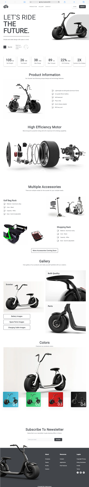
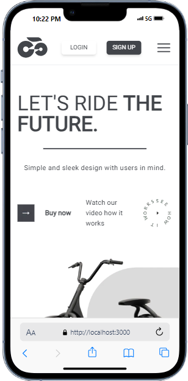
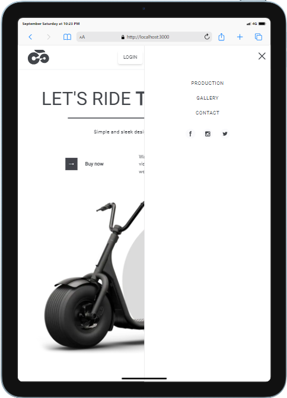

# Landing Page Next Js Project

This is a website example of Landing Page. 

## Table of contents

- [Landing Page Next Js Project](#landing-page-next-js-project)
  - [Table of contents](#table-of-contents)
  - [Overview](#overview)
    - [Screenshot](#screenshot)
    - [Installation](#installation)
  - [Technologies that I used for this project](#technologies-that-i-used-for-this-project)
    - [Next JS](#next-js)
    - [TypeScript for Next](#typescript-for-next)
    - [Vite](#vite)
    - [Tailwind CSS](#tailwind-css)
  - [Contributing](#contributing)
  - [License](#license)

## Overview

### Screenshot





### Installation

To run project locally wrote code line below in terminal of project root

```bash
npm run dev
```


## Technologies that I used for this project

### Next JS

[Next](https://nextjs.org/) The React Framework for the Web. Used by some of the world's largest companies, Next.js enables you to create high-quality web applications with the power of React components. To create and install environment for Next JS I used Vite front end tool.

```
npx create-next-app@latest
```

### TypeScript for Next

[TypeScript](https://www.typescriptlang.org/) TypeScript is a strongly typed programming language that builds on JavaScript, giving you better tooling at any scale.

### Vite

[Vite](https://vitejs.dev/) is a platform-agnostic frontend tool for building web applications quickly and solves some common developer headaches.


### Tailwind CSS

[Tailwind CSS](https://tailwindcss.com/) is a utility-first CSS framework. To configuration it comes as a choice when running code for create nextjs app.


## Contributing

Pull requests are welcome. For major changes, please open an issue first
to discuss what you would like to change.

Please make sure to update tests as appropriate.

## License

[MIT](https://choosealicense.com/licenses/mit/)
